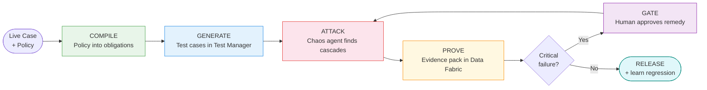

# Preflight

> **UiPath AgentHack 2026 · Track 3 — UiPath Test Cloud**
> Prove high-stakes plans before they touch a person. Branch reality. Break the plan. Prove the outcome. Then act.

---

## The Problem

Mrs. Chen is 72. Hip replacement. Doctor signed the discharge papers. Transport booked. Medications prescribed. Everything looked fine.

She went home. Two hours later, her daughter called the pharmacy. The medication was not there.

Why? Transport was booked for 5:15 PM. The pharmacy closes at 5:00 PM. Nobody caught it because the transport, the prescription, and the pharmacy hours each lived in a different system.

Software gets tested before it goes live. These plans do not. Preflight closes that gap.

---

## What Preflight Does

Preflight is an agentic testing system for high-stakes, irreversible plans. Before a plan executes, it:

1. Reads the governing policy and compiles it into outcome obligations
2. Generates a live test case in UiPath Test Manager for every obligation, automatically
3. Runs an adversarial chaos agent that finds hidden cross-system failure cascades
4. Produces an auditable evidence pack with the exact causal chain
5. Blocks release if anything critical fails, routes it to a human with a proposed fix
6. After human approval, re-tests everything, releases, and stores a regression scenario

Demo domain: **safe hospital discharge** using 100% synthetic data. Preflight validates operational readiness only. It never diagnoses, prescribes, or changes medication. A human approves every change.

---

## How It Works



In the demo, patient PT-1041 looks ready to discharge. Preflight finds that transport arrives at 5:15 PM and the pharmacy closes at 5:00 PM, so the medication can never be collected. Discharge is blocked. A nurse approves switching to a 24-hour pharmacy. Preflight re-tests, passes 9 from 9, and releases.

---

## UiPath Components Used

| Component | Role |
|---|---|
| **UiPath Test Manager (Test Cloud)** | Agentic test-case generation from policy: 9 severity-tagged test cases, all linked to Requirement PRF:10 for full policy-to-test traceability |
| **UiPath Data Fabric (Data Service)** | Live system of record for every case, obligation, evidence pack, and human decision. Nothing hardcoded |
| **UiPath Agent Builder (Studio Web)** | Published low-code Obligation Compiler agent that turns a discharge plan and policy into structured obligations |
| **UiPath for Coding Agents (Claude Code)** | Built the entire rehearsal engine: chaos search, evaluator, remedy proposer, and all UiPath integrations |
| **External framework: LangGraph** | Adversarial red-team agent that attacks the plan and writes findings back to Data Fabric, governed by UiPath |
| **UiPath Identity / External Applications** | OAuth client-credentials securing all platform API access |
| **Live dashboard** | Backend-driven web dashboard reading Data Fabric and Test Manager live, with contextual help from the HelpContent entity |

---

## Agent Type

**Both, and a blend of three.**

- **Low-code agent**: UiPath Agent Builder hosts the Obligation Compiler agent
- **Coded agent**: The entire rehearsal engine was built with Claude Code via UiPath for Coding Agents (bonus)
- **External framework agent**: LangGraph red-team agent governed by UiPath Data Fabric

This is the exact "blend native plus external plus coding agents" pattern the hackathon rewards.

---

## Repository Layout

```
preflight/
├── engine/              # Platform-independent reference engine (pure stdlib, 6 passing tests)
│   ├── models.py        # Data models
│   ├── compiler.py      # Policy to obligations
│   ├── chaos.py         # Adversarial dependency search
│   ├── evaluator.py     # Obligation evaluation
│   ├── remedy.py        # Operational remedy proposer
│   ├── evidence.py      # Evidence pack builder
│   └── orchestrator.py  # End-to-end orchestration
├── integration/         # UiPath platform integration (live)
│   ├── uipath_client.py      # OAuth + Data Fabric + Test Manager REST client
│   ├── seed_data.py          # Seed synthetic cases into Data Fabric
│   ├── rehearse_case.py      # Rehearsal agent: block / release stages
│   ├── tm_sync.py            # Generate Test Manager test cases
│   ├── requirements_sync.py  # Link test cases to governing Requirement
│   ├── redteam_agent.py      # LangGraph red-team agent
│   ├── control_view.py       # Live status from Data Fabric and Test Manager
│   └── build_dashboard.py    # Generate live web dashboard
├── data/                # Synthetic cases, discharge policy, help content
├── tests/               # End-to-end tests (6/6 passing)
└── docs/                # Architecture, coding-agent evidence, Devpost
```

---

## Setup Instructions

### Prerequisites

- Python 3.10 or higher (no third-party packages for the reference engine)
- A UiPath Automation Cloud tenant with Data Fabric and Test Manager enabled
- An External Application (OAuth client-credentials) with `DataFabric.Data.*` and `TM.*` scopes
- A Test Manager project named `Preflight`

### Step 1: Clone the repo

```bash
git clone https://github.com/usv240/preflight.git
cd preflight
```

### Step 2: Run the reference engine (no platform needed)

This works offline with zero setup. Proves the core logic instantly.

```bash
python tests/test_end_to_end.py
# Expected: 6/6 tests pass

python scripts/run_demo.py golden_case
# Narrated block, remedy, re-test, release
```

### Step 3: Configure platform credentials

```bash
cp integration/.env.example integration/.env
# Fill in your UiPath App ID, App Secret, and tenant URL
```

### Step 4: Run on the UiPath platform

```bash
# Seed synthetic patient data into Data Fabric (run once)
python integration/seed_data.py

# Generate 9 test cases in Test Manager
python integration/tm_sync.py

# Link all test cases to the governing Requirement (PRF:10)
python integration/requirements_sync.py

# Block the case (simulates the transport/pharmacy failure)
python integration/rehearse_case.py block

# See the live status: RED, Blocked, causal chain
python integration/control_view.py

# Run the LangGraph red-team agent
python integration/redteam_agent.py

# Generate the live dashboard
python integration/build_dashboard.py
# Open out/preflight_dashboard.html in a browser

# Apply the nurse-approved remedy and re-test
python integration/rehearse_case.py release

# Confirm GREEN, Released, 100%
python integration/control_view.py

# Regenerate dashboard to show GREEN state
python integration/build_dashboard.py
```

LangGraph agent requires: `pip install -r integration/requirements.txt`

---

## Safety and Data

100% synthetic data. No real PHI or PII anywhere. Preflight validates operational readiness only. It does not diagnose, prescribe, or change medication. Every clinical decision stays with a human.

---

## License

MIT. See [LICENSE](LICENSE).
